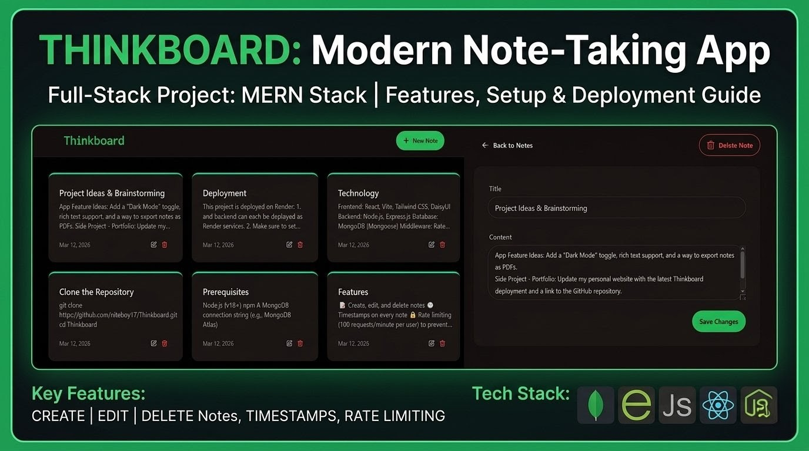

# 🧠 Thinkboard




A full-stack notes web application built with the **MERN stack** (MongoDB, Express, React, Node.js). Thinkboard lets users create, update, and delete notes with a clean, responsive UI — and includes rate limiting to keep things secure.

🔗 **Live Demo:** [Click Here](https://thinkboard-1rsx.onrender.com/)

---

## 📸 Screenshots

### Desktop

| Home Page | Create Note | Note Detail |
|:---------:|:-----------:|:-----------:|
|  Home Page |  Create Note |  Note Detail Page |

### Mobile

| Home Page | Create Note | Note Detail |
|:---------:|:-----------:|:-----------:|
|  Home Page |  Create Page |  Note Detail Page |

---

## ✨ Features

- 📝 Create, edit, and delete notes
- 🕒 Timestamps on every note
- 🔒 Rate limiting (100 requests/minute per user) to prevent abuse
- ⚡ Fast, responsive UI built with React + Vite
- 🎨 Styled with Tailwind CSS and DaisyUI
- 🔔 Toast notifications via React Hot Toast

---

## 🛠️ Tech Stack

| Layer      | Technology                          |
|------------|-------------------------------------|
| Frontend   | React, Vite, Tailwind CSS, DaisyUI  |
| Backend    | Node.js, Express.js                 |
| Database   | MongoDB (Mongoose)                  |
| Middleware | Rate limiting, custom Express middleware |
| Deployment | Render                              |

---

## 📁 Project Structure

```
Thinkboard/
├── backend/
│   ├── src/
│   │   ├── config/        # Database connection
│   │   ├── controllers/   # Route controllers
│   │   ├── middleware/    # Rate limiter & other middleware
│   │   ├── models/        # Mongoose schemas
│   │   ├── routes/        # API routes
│   │   └── server.js      # Express entry point
│   └── package.json
│
└── frontend/
    ├── src/
    │   ├── components/    # Reusable UI components
    │   ├── pages/         # Page views (Home, Create, Detail)
    │   └── main.jsx
    ├── index.html
    └── package.json
```

---

## 🚀 Getting Started

### Prerequisites

- [Node.js](https://nodejs.org/) (v18+)
- [npm](https://www.npmjs.com/)
- A MongoDB connection string (e.g., [MongoDB Atlas](https://www.mongodb.com/atlas))

### 1. Clone the Repository

```bash
git clone https://github.com/niteboy17/Thinkboard.git
cd Thinkboard
```

### 2. Set Up the Backend

```bash
cd backend
npm install
```

Create a `.env` file inside `backend/`:

```env
MONGO_URI=your_mongodb_connection_string
PORT=5001
```

Start the backend server:

```bash
npm run dev
```

### 3. Set Up the Frontend

```bash
cd ../frontend
npm install
npm run dev
```

The app will be available at `http://localhost:5173`.

---

## 🔌 API Endpoints

| Method | Endpoint         | Description          |
|--------|------------------|----------------------|
| GET    | `/api/notes`     | Get all notes        |
| POST   | `/api/notes`     | Create a new note    |
| PUT    | `/api/notes/:id` | Update a note by ID  |
| DELETE | `/api/notes/:id` | Delete a note by ID  |

> Rate limiting: **100 requests per minute** per IP address.

---

## 📦 Scripts

### Backend

| Command         | Description              |
|-----------------|--------------------------|
| `npm run dev`   | Start server with nodemon |
| `npm start`     | Start server (production) |

### Frontend

| Command         | Description                |
|-----------------|----------------------------|
| `npm run dev`   | Start Vite dev server      |
| `npm run build` | Build for production       |
| `npm run preview` | Preview production build |

---

## 🌐 Deployment

This project is deployed on **Render**.

- Frontend and backend can each be deployed as separate Render services.
- Make sure to set environment variables (`MONGO_URI`, `PORT`) in the Render dashboard.

---

## 📄 License

This project is open source and available under the [MIT License](LICENSE).
